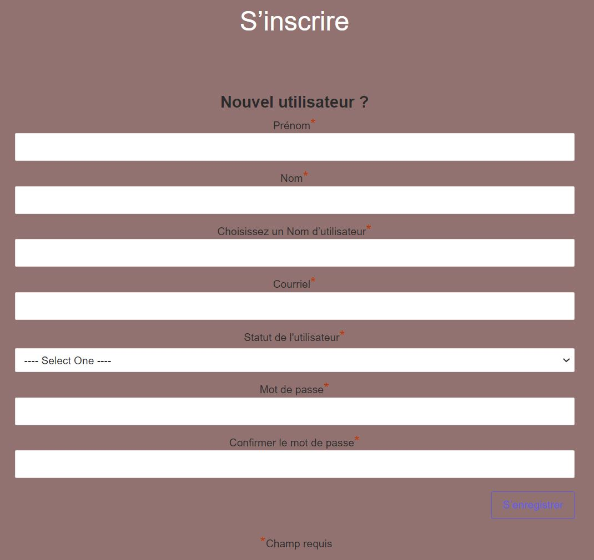

# Notre solution 
Nous avons mis en place une story map qui retrace le parcours de l'utilisateur au sein du site web :

 

Puis le Product Backlog, qui regroupe toutes les pages et fonctionnalités du site web par priorité, et chacunes possède un état et est attribuée à un membre de l'équipe :

 

## Accueil
On retrouve ci-dessous, la page d’accueil du site web Scentsoft, nous avons pour cela établi une charte graphique. La palette de couleurs choisies et la police d’écriture ont été respectées et utilisées sur tout le site. On retrouve dans le header le logo du site, ainsi que les pages principales que les utilisateurs pourront visiter :

 

## Offres
Voici la page des offres disponibles selon le statut des utilisateurs :

 

## Formulaire de contact

Voici le formulaire de contact permettant aux utilisateurs de soummetre une quelconque demande :

 

## F.A.Q
Voici la F.A.Q permettant de répondre aux questions les plus posées par les utilisateurs.

 

## Inscription
Voici le formulaire d'inscription pour :

 

## Connexion
Voici le formulaire de connexion pour les adhérents :

 

## Les extensions utilisées
Voici les différentes extensions que nous avons utilisés.
Nous utilisons bbPress pour le forum, Ninja Forms pour créer les formulaires (contact, inscription, connexion), Ninja Table pour afficher la table des matières premières, wp-members pour gérer la création de compte et les connexions, et enfin le plug-in Elementor pour éditer le site :

 

## Performances 
Pour la version ordinateur, est de 87%, ce qui est un relativement bon score. Nous avons un SEO à 82%, ce qui équivaut à un bon référencement. Et l'accessibilité est de 83% pour l’accessibilité.

 

## Base de données
Nous avons utilisés le logiciel PhpMyAdmin pour créer la base de données des utilisateurs, que l'on peut voir ci-dessous :

 

## Le site
Voici le lien de notre site, n'hésitez pas à le visiter et me faire parvenir vos retours !
 
http://nsaidani.ecv-monsite.fr/scentsoft_neh/

