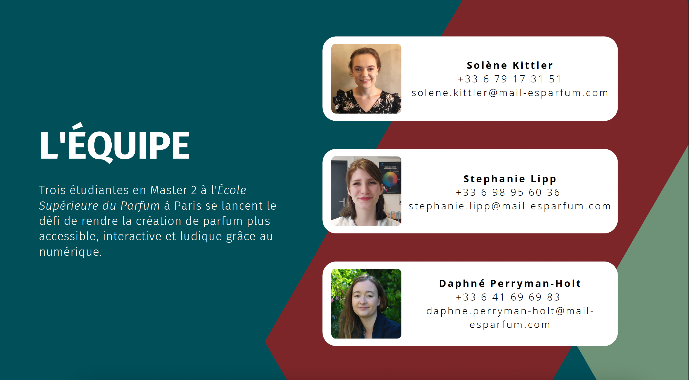
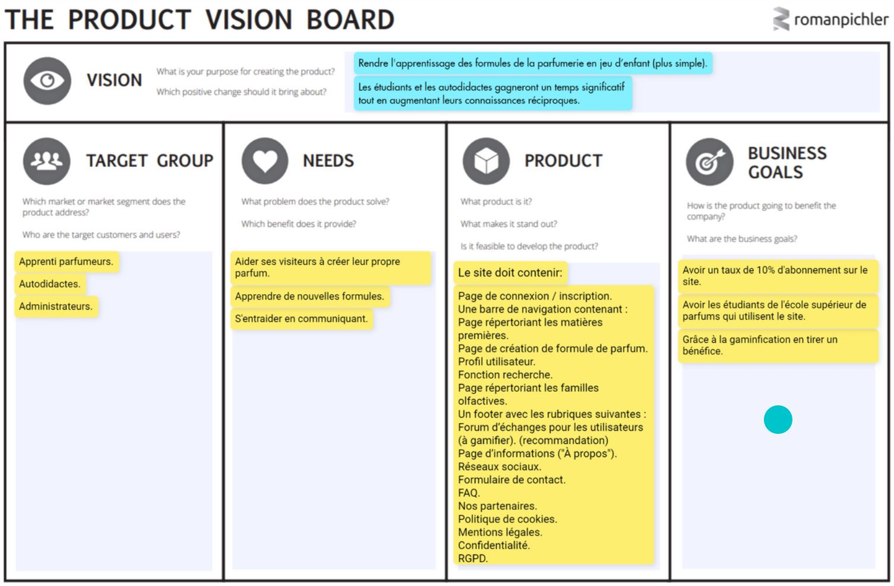

# Scentsoft 

## Le projet
Publier un site internet pour donner à des autodidactes, des apprentis parfumeurs et des professionnels la possibilité, de créer, stocker, et partager des formules.

## Le groupe de travail
Notre nom est NEH (Nabil et Helwan) Nous sommes une équipe de deux développeurs web.
Notre particularité est d’aller jusqu’au bout de nos projets en apportant aux clients une vision technique pour leur soumettre des propositions selon leurs besoins.

## Notre contexte
Ce projet est l’aboutissement de notre 3ème année de bachelor en chef de projet digital.
Il nou a été proposé par notre école afin de nous rendre polyvalent dans les trois champs professionnels de notre cursus : Marketing/Communication, UI/UX Design ainsi que développement web.
Scentsoft nous a sollicité pour répondre à leurs besoins.

## Notre client

Leurs attentes auprès de nous sont de leur fournir un site web fonctionnel, ergonomique, de qualité.
Et qu'il soit attrayant : qui donne envie aux utilisateurs d'y consacrer du temps et d'y revenir.

 

# Enjeux

## Problématique
Comment faciliter et rendre plus accessible la création de formules ?

## Objectifs

Les objectifs du projet sont organisés en 3 axes principaux :

### Création de formules :
- Éditeur de formules
- Gestion de contenu
- Base de données dynamique des matières premières

### Olfaction : 
- Jeux et exercices d'apprentissage pour entraîner son odorat
- Liste des MP - méthode de classification Jean Carles (distingue les naturelles des synthétiques)

### Communautaire : 
- Création d’une communauté
- Échange de connaissances via un forum
- Partage des formules en mode collaboratif

## Product Vision Board
Suite à l'expression des besoins des clientes, avant de débuter le projet, nous avons mis en place un Product Vision Board, qui retranscrit la vision idéale des clientes pour leur produit :

